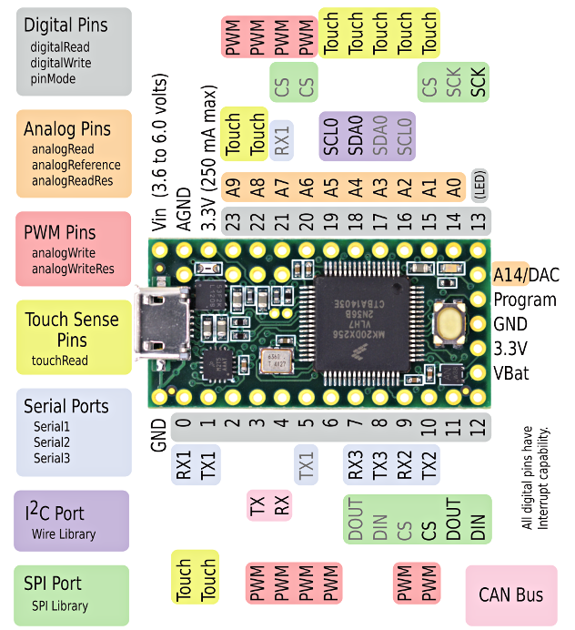
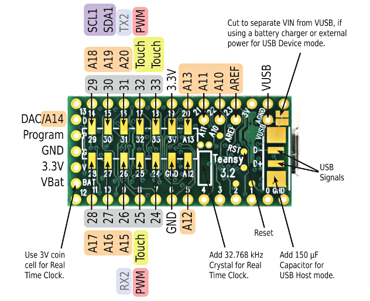
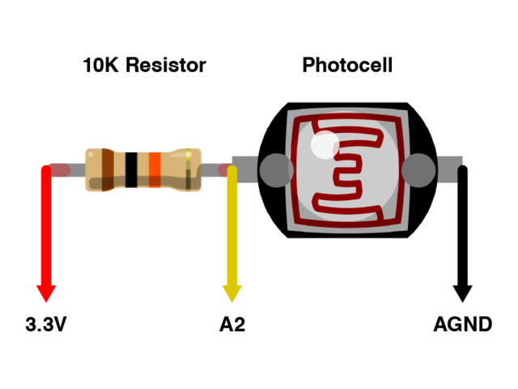

# Arduino Teensy Eyes

Directly based on [Teensy3.1_Eyes](https://github.com/adafruit/Teensy3.1_Eyes/) with documentation from [Electronic Animated Eyes using Teensy 3.1/3.2](https://learn.adafruit.com/animated-electronic-eyes-using-teensy-3-1) and [Eye of Newt](https://learn.adafruit.com/eye-of-newt).  Go look there for details.  This contains the changes I made.  Namely option to remove the eyelids and other minor tweaks.

Note that you will have to install the [Teensy software](https://www.pjrc.com/teensy/td_download.html) to compile the code

---

Arduino IDE seettings:
* Board:  Teensy 3.1/3.2
* USB Type:  Serial
* CPU Speed: 72 MHz (THIS IS IMPORTANT!)
* Optimize:  Faster
* Programmer:  ArduinoISP

---

Parts:
* [Teensy 3.2 + header](https://www.adafruit.com/product/2756)
* [OLED Breakout Board - 16-bit Color 1.5" w/microSD holder](https://www.adafruit.com/product/1431)

---

<table>
  <tr>
    <td><b>OLED</b></td>
    <td><b>Teensy</b></td>
  </tr>
  <tr>  <td>GND</td>     <td>G (GND)</td>   </tr>
  <tr>  <td>Vin</td>     <td>V (3.3V)</td>  </tr>
  <tr>  <td>3Vo</td>     <td></td>          </tr>
  <tr>  <td>CD</td>      <td></td>          </tr>
  <tr>  <td>MISO</td>    <td></td>          </tr>
  <tr>  <td>SDCS</td>    <td></td>          </tr>
  <tr>  <td>OLEDCS</td>  <td>9</td>         </tr>
  <tr>  <td>RESET</td>   <td>8</td>         </tr>
  <tr>  <td>DC</td>      <td>7</td>         </tr>
  <tr>  <td>SCK</td>     <td>13</td>        </tr>
  <tr>  <td>MOSI</td>    <td>11</td>        </tr>
</table>

One side of photocell to AGND, another to A2.  Also connect A2 to Analog 3.3V (next to AGND) with a 10k resistor

